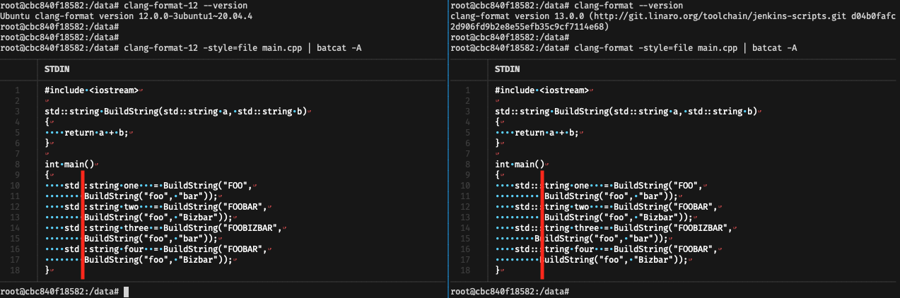

# clang-format-diff

Demo to show the diff between `clang-format` 13 and `clang-format` 12 regarding
alignment. With the same configuration the indentation after wrapping a line in
a function call differs between the two versions and no longer align in
`clang-format` version 13.



## Running

```sh
clang-format -style=file main.cpp | bat -A
```

### clang-format-12

```sh
#include•<iostream>␊
␊
std::string•BuildString(std::string•a,•std::string•b)␊
{␊
••••return•a•+•b;␊
}␊
␊
int•main()␊
{␊
••••std::string•one•••=•BuildString("FOO",␊
••••••••BuildString("foo",•"bar"));␊
••••std::string•two•••=•BuildString("FOOBAR",␊
••••••••BuildString("foo",•"Bizbar"));␊
••••std::string•three•=•BuildString("FOOBIZBAR",␊
••••••••BuildString("foo",•"bar"));␊
••••std::string•four••=•BuildString("FOOBAR",␊
••••••••BuildString("foo",•"Bizbar"));␊
}␊
```


### clang-format-13

```sh
#include·<iostream>␊
␊
std::string·BuildString(std::string·a,·std::string·b)␊
{␊
····return·a·+·b;␊
}␊
␊
int·main()␊
{␊
····std::string·one···=·BuildString("FOO",␊
··········BuildString("foo",·"bar"));␊
····std::string·two···=·BuildString("FOOBAR",␊
··········BuildString("foo",·"Bizbar"));␊
····std::string·three·=·BuildString("FOOBIZBAR",␊
········BuildString("foo",·"bar"));␊
····std::string·four··=·BuildString("FOOBAR",␊
·········BuildString("foo",·"Bizbar"));␊
}␊
```
